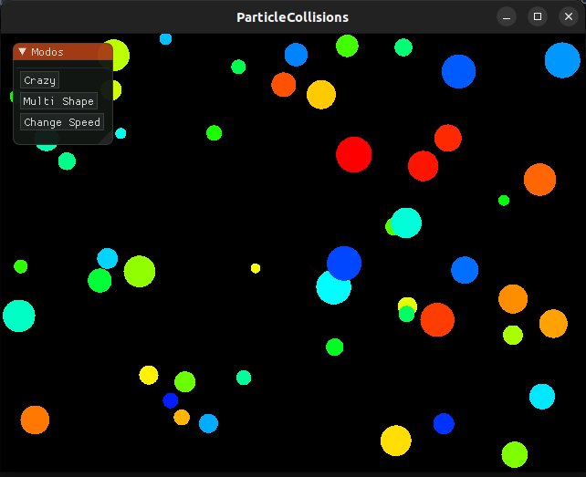
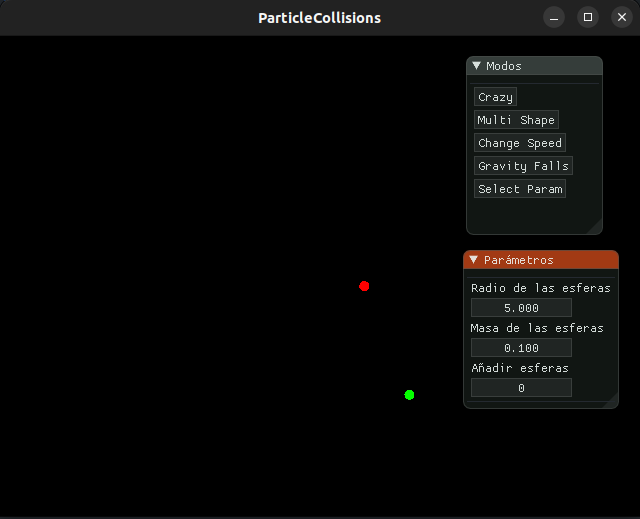
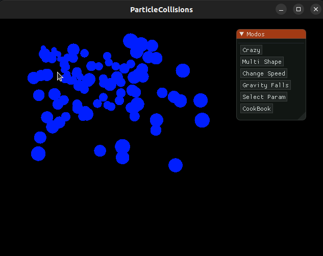

# ParticleCollisions
Implementación de sistemas de partículas con renderizado y texturizado para la simulación de colisiones, utilizando la librería [Cinder](https://libcinder.org/) de C++.

# Requerimientos
* Linux
* Cinder ([¿Cómo instalar en linux?](https://libcinder.org/docs/guides/linux-notes/ubuntu.html))

# ¿Cómo crear un nuevo modo?
## Creación del archivo principal
Cree un archivo `.h` en la carpeta [include](../DrivingCinder/ParticleCollisions/include/). Si su clase se llama `NewMode`, luego esta debe heredar de la clase abstracta [`Mode`](../DrivingCinder/ParticleCollisions/include/Mode.h). La estructura mínima de la clase debe ser:

```cpp
class NewMode : public Mode {
   public:
    void setup();
    void update();
    void draw();
};

```
## Puesta en marcha
- Para integrar las funcionalidades del nuevo modo, incluir el archivo `NewMode.h` en el archivo principal ([ParticleCollisions.cpp](./ParticleCollisions/src/ParticleCollisions.cpp)) como un header file.
- En la función [`imGuiUpdate()`](./ParticleCollisions/src/ParticleCollisions.cpp) incluir un nuevo botón, con su inicialización. Así:


```cpp
void ParticleCollisions::imGuiUpdate() {
    ImGui::Begin("Modos");
    ImGui::Separator();

    ...

    // New Mode
    if (ImgGui::Butten("New Mode")) {
        selectedMode = new NewMode();
        selectedMode->setup();
    }

    ImGui::End();  // Draw the ImGui UI
}
```

# Modos implementados
|   |  |  |
|:---:|:---:|:---:|
| [CrazyParticles](./ParticleCollisions/include/CrazyParticles.h) |  [ChangeSpeed](./ParticleCollisions/include/ChangeSpeed.h) |  [MultiShape](./ParticleCollisions/include/MultiShape.h) | 

|  |  |  |
|:---:|:---:|:---:|
| [SelectParam](./ParticleCollisions/include/SelectParam.h) | [GravityFalls](./ParticleCollisions/include/GravityFalls.h) | [CookBook](./ParticleCollisions/include/ParticlesApp.h) |


# ¿Cómo usarlo?
Corra el archivo [startup.sh](./ParticleCollisions/startup.sh). Este archivo compila las dependencias necesarias y corre la simulación. 
