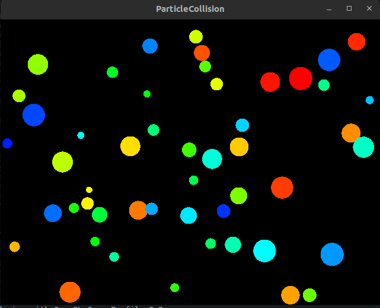

# ParticleCollisions
Implementación de un sistema de partículas con renderizado y texturizado para la simulación de colisiones, utilizando la librería [Cinder](https://libcinder.org/) de C++.

# Requerimientos
* Linux
* Cinder ([¿Cómo instalar en linux?](https://libcinder.org/docs/guides/linux-notes/ubuntu.html))
# ¿Cómo usarlo?
Corra el archivo [startup.sh](./ParticleCollisions/startup.sh). Este archivo compila las dependencias necesarias y corre la simulación.

# Ejemplo
